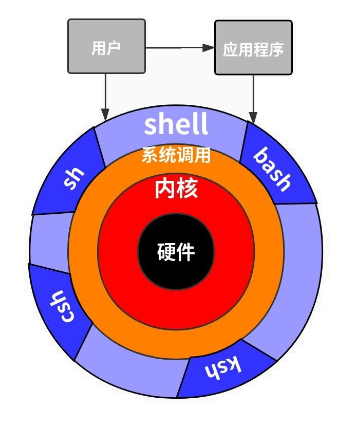
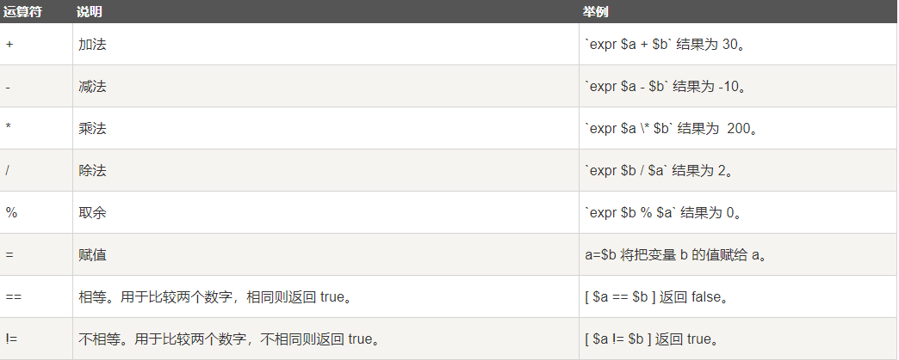
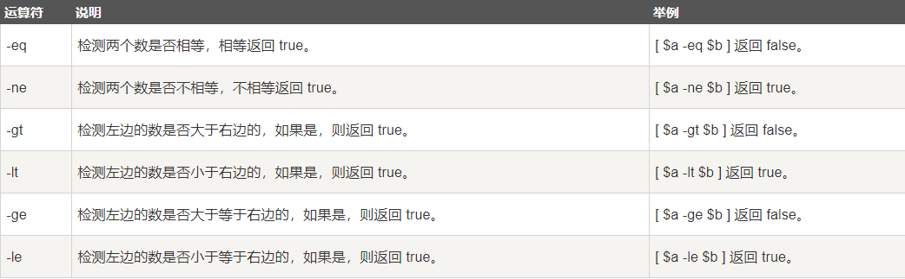
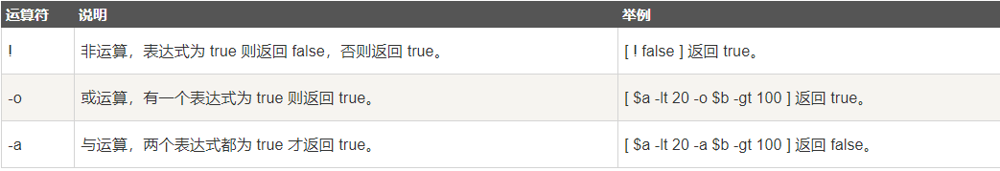
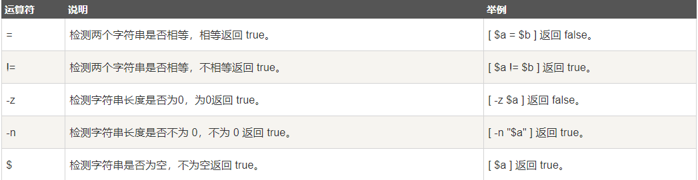
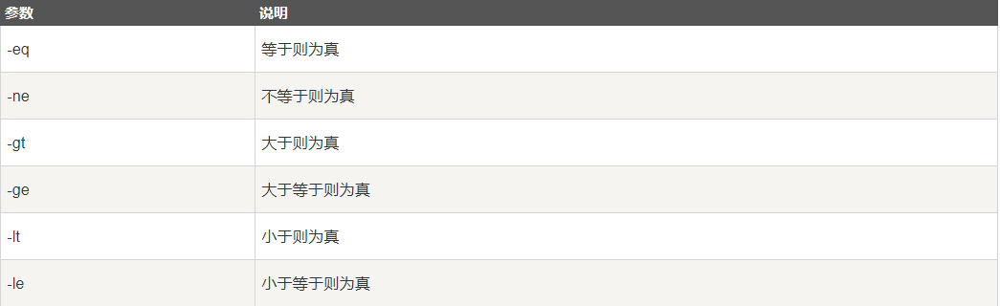
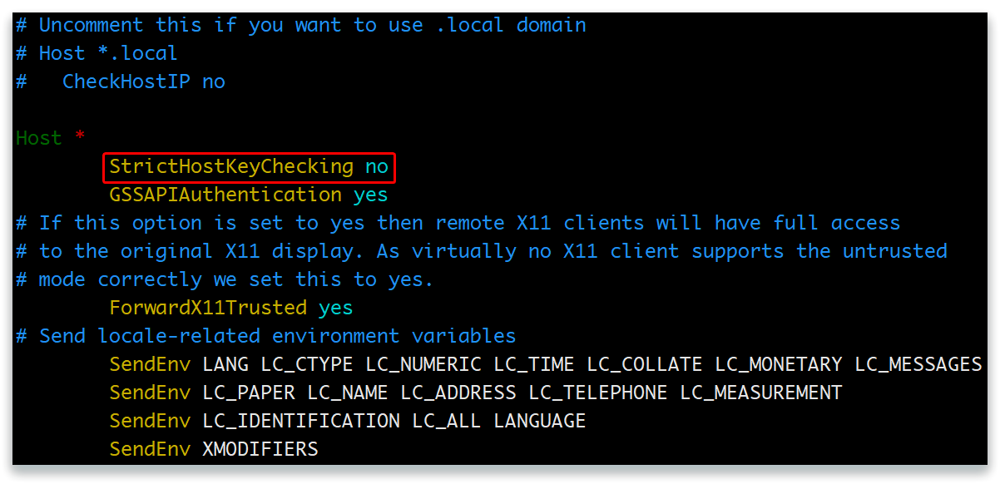

---
# 文章标题，请和目录名保持一致
title: "Shell"
# 发布日期
date: 2024-07-01T08:00:00+08:00
# 权重
weight: 1
# 是否为草稿，如果是草稿，在系统时间未到发布日期前不显示
draft: false
description: "介绍 Blowfish 中所有可用的的配置变量。"
# 目录名
slug: "shell"
# 标签
tags: ["Shell", "运维"]
# 系列
# 是否是一个连续系列中的文档，页面会出现：部署教程 - 这篇文章属于一个选集
series: ["部署教程"]
# 该文章在系列中的顺序
series_order: 1
---


## Shell 编程概述


　　Shell 本身并不是内核的一部分，它只是站在内核的基础上编写的一个应用程序，它和 QQ、迅雷、Firefox 等其它软件没有什么区别。然而 Shell 也有着它的特殊性，就是开机立马启动，并呈现在用户面前；用户通过 Shell 来使用 Linux，不启动 Shell 的话，用户就没办法使用 Linux。

　　在计算机科学中，Shell 俗称壳（用来区别于核），是指“为使用者提供操作界面”的软件（command interpreter，命令解析器）。它类似于 DOS 下的 COMMAND.COM 和后来的 cmd.exe。它接收用户命令，然后调用相应的应用程序。

　　Shell 并不是简单的堆砌命令，我们还可以在 Shell 中编程，这和使用 C++、Java、Python 等常见的编程语言并没有什么两样。

　　Shell 虽然没有 C++、Java、Python 等强大，但也支持了基本的编程元素，例如：

- 变量、数组、字符串、注释、加减乘除、逻辑运算等概念；
- if...else 选择结构，case...in 开关语句，for、while、until 循环；
- 函数，包括用户自定义的函数和内置函数（例如 printf、export、eval 等）。

　　站在这个角度讲，Shell 也是一种编程语言，它的编译器（解释器）是 Shell 这个程序。我们平时所说的 Shell，有时候是指连接用户和内核的这个程序，有时候也指 Shell 编程。


## Shell 名词解释


### Shell


　　Shell 是一个用 C 语言编写的程序，它是用户使用 Linux 的桥梁。Shell 也是一个命令行解释器，是用户和内核之间的接口。用户可以在 Shell 中输入命令，然后，它解释命令来执行所需的任务。此外，它还可以执行程序和 Shell 脚本。Shell 脚本是一组命令，用户应该遵循标准语法向 Shell 写入命令。

　　总的来说，Shell 是指一种应用程序，这个应用程序提供了一个界面，用户通过这个界面访问操作系统内核的服务。Shell 既是一种命令语言，又是一种程序设计语言，如果要与内核打交道就必须学习 Shell 语言。


#### 分类


　　Shell 是提供与内核沟通接口的命令解释器程序，但实际上 Shell 是这种解释器的统称，Linux 系统的 Shell 种类很多，包括 Bourne Shell（简称 sh）、Bourne Again Shell（简称 bash）、C Shell（简称 csh）、K shell（简称 ksh）、Shell for Root 等等。如下图：



　　也就是说 sh 和 bash 都是 Linux 系统 Shell 的一种，其中 bash 命令是 sh 命令的超集，大多数 sh 脚本都可以在 bash 下运行。Linux 系统中预设默认使用的就是 bash。

　　要想知道操作系统支持哪种Shell类型，可在终端中输入以下命令：

```shell
[root@node01 ~]# cat /etc/shells
/bin/sh
/bin/bash
/usr/bin/sh
/usr/bin/bash
```

　　要想知道 bash 在操作系统中具体的位置，可通过以下命令查看：

```shell
[root@node01 ~]# which bash sh
/usr/bin/bash
/usr/bin/sh
```


#### She Bang


　　**She Bang** 是 Shell 脚本开头字符`#!`也可以叫 **Sha Bang**，当 Shell 文件被 Linux 系统读取时，内核会通过`#!`表示的值（`0x23, 0x21`）识别出随后的解释器路径并调用，最后再将整个脚本内容传递给解释器。由于 Shell 当中`#`字符同时表示注释，因此 Shell 解释脚本文件时会自动忽略该行。

　　总结：`#!`就是告诉系统解释此脚本文件的 Shell 程序在哪（其后路径所指定的程序）。例如：

```sh
#!/bin/bash

echo "Hello World!"
```

　　She Bang 的格式很重要，格式不正确会导致命令工作不正常。因此，在创建脚本时，要始终记住 She Bang 格式的这两点：

- 它应该始终在脚本的第一行。
- 在`#!`和解释器的路径之间，`#`之前不应有任何空格。

> `echo`是 bash 中的内置命令，用于通过传递参数来显示标准输出。它是用于将文本/字符串行打印到屏幕上的最广泛使用的命令。


### 脚本


　　在计算机编程中，脚本是用于适当的运行时环境的一组命令，这些命令用于自动执行任务。

　　我们经常说的 Shell 脚本，其实就是利用 Shell 的功能，编写能够直接运行的脚本文件。


## 第一个 Shell 脚本


　　几乎所有的编程语言教程都是从著名的“Hello World”开始，出于对这种传统的尊重，我们的第一个 Shell 脚本也输出“Hello World”。

　　打开文本编辑器，新建一个文本文件，并命名为 hello.sh。

> 扩展名`sh`代表 shell，扩展名并不影响脚本执行，见名知意就好。

　　在 hello.sh 中输入代码：

```sh
#!/bin/bash

echo "Hello World!"
```

　　`#!`是一个约定的标记，它告诉系统这个脚本需要什么解释器来执行，即使用哪一种 Shell；后面的`/bin/bash`就是指明了解释器的具体位置。

　　`echo`命令用于向标准输出文件（Standard Output，stdout，一般就是指显示器）输出文本。在`.sh`文件中使用命令与在终端直接输入命令的效果是一样的。

　　接下来使用`bash`或`sh`运行脚本：

```shell
[root@node01 ~]# bash hello.sh 
Hello World!
```


## Shell 脚本执行


　　脚本的执行并非只有`bash`和`sh`，还有`source`和`.`且它们之间还存在一些细微的差异，接下来我们详细的给大家讲解一下。


### 使用路径


　　格式：`相对路径/脚本.sh`或`绝对路径/脚本.sh`。

　　注意：脚本文件必须为可执行文件（拥有 x 权限）。

　　范例：

```shell
[root@node01 ~]# ls -l
total 4
-rw-r--r-- 1 root root    33 May 29 11:57 hello.sh
[root@node01 ~]# /root/hello.sh
bash: /root/hello.sh: Permission denied
[root@node01 ~]# chmod ug+x hello.sh 
[root@node01 ~]# ./hello.sh 
Hello World!
[root@node01 ~]# /root/hello.sh 
Hello World!
```


### bash 或 sh


　　格式：`bash 脚本.sh`或`sh 脚本.sh`。

　　范例：

```shell
[root@node01 ~]# ls -l
total 4
-rw-r--r-- 1 root root 33 May 29 11:57 hello.sh
[root@node01 ~]# bash hello.sh 
Hello World!
[root@node01 ~]# sh hello.sh 
Hello World!
```


### source 或 `.`


　　格式：`source 脚本.sh`或`. 脚本.sh`

　　范例：

```shell
[root@node01 ~]# ls -l
total 4
-rw-r--r-- 1 root root 33 May 29 11:57 hello.sh
[root@node01 ~]# . hello.sh 
Hello World!
[root@node01 ~]# source hello.sh 
Hello World!
```


### 区别


　　bash 或 sh 执行脚本时会新开一个 bash，不同 bash 中的变量无法共享。而 source 或 `.` 是在同一个 bash 里面执行的，所以变量可以共享。

　　范例：

```shell
[root@node01 ~]# cat hello.sh 
#!/bin/bash

echo "Hello World!"
echo ${name}

[root@node01 ~]# name=mrhelloworld
[root@node01 ~]# bash hello.sh 
Hello World!

[root@node01 ~]# sh hello.sh 
Hello World!

[root@node01 ~]# . hello.sh 
Hello World!
mrhelloworld
[root@node01 ~]# source hello.sh 
Hello World!
mrhelloworld
```

　　在脚本中添加`ping baidu.com`的指令，用不同的方式重新执行脚本并查看进程。

```shell
[root@node01 ~]# echo "ping baidu.com" >> hello.sh 
[root@node01 ~]# cat hello.sh 
#!/bin/bash

echo "Hello World!"
echo ${name}
ping baidu.com
```

　　bash：

```shell
[root@node01 ~]# bash hello.sh
[root@node01 ~]# ps -ef
root       4447   4445  0 12:15 pts/0    00:00:00 -bash
root       4494   4447  0 12:17 pts/0    00:00:00 bash hello.sh
root       4495   4494  0 12:17 pts/0    00:00:00 ping baidu.com
```

　　sh：

```shell
[root@node01 ~]# sh hello.sh
[root@node01 ~]# ps -ef
root       4447   4445  0 12:15 pts/0    00:00:00 -bash
root       4497   4447  0 12:18 pts/0    00:00:00 sh hello.sh
root       4498   4497  0 12:18 pts/0    00:00:00 ping baidu.com
```

　　source：

```shell
[root@node01 ~]# source hello.sh
[root@node01 ~]# ps -ef
root       4447   4445  0 12:15 pts/0    00:00:00 -bash
root       4502   4447  0 12:19 pts/0    00:00:00 ping baidu.com
```

　　`.`：

```shell
[root@node01 ~]# . hello.sh
[root@node01 ~]# ps -ef
root       4447   4445  0 12:15 pts/0    00:00:00 -bash
root       4508   4447  0 12:25 pts/0    00:00:00 ping baidu.com
```

　　怎么解决这个问题呢？可以使用`export`命令，它可以将当前进程的变量传递给子进程去使用，如下：

```shell
[root@node01 ~]# export name=mrhelloworld
[root@node01 ~]# bash hello.sh 
Hello World!
mrhelloworld
```

　　所以，将来在配置环境变量（profile 文件）的时候，所有的变量前必须加`export`。


## Shell 基础


### 注释


#### 单行注释


　　要在 bash 中编写单行注释，必须在注释的开头使用井号`#`。

```sh
#!/bin/bash

# 我是注释
```


#### 多行注释


　　有两种方法可以在 bash 脚本中插入多行注释：

- 通过在`<< COMMENT`和`COMMENT`之间加上注释，可以在 bash 脚本中编写多行注释。
- 也可以通过将注释括在`: '`和单引号`'`之间来编写多行注释。

```sh
#!/bin/bash

<< EOF
我是注释
我是注释
我是注释
EOF

echo "Hello World!"
```

> 提示：EOF 表示 End Of File，表示文件结尾，这里代指从哪开始到哪结束。EOF 只是一个名称而已，可以使用任意非关键字名称进行替换，例如 COMMENT，通常都使用 EOF。

　　或者：

```sh
#!/bin/bash

: '
我是注释
我是注释
我是注释
'

echo "Hello World"
```


### 变量


#### 语法


　　变量是将数据或有用的信息作为值存储的容器。变量的值可以更改，并且可以多次使用。变量是任何类型的数据（例如整数，浮点数，字符等）的临时存储。

　　定义变量时，变量名不加`$`符号，而引用变量时则需要使用`$`。同其他编程语言一样，Shell 的变量声明也需要遵循一定的规则：

- 可以包含字母，数字和下划线。
- 只能以字母和下划线开头，不能定义以任何数字开头的变量名称。
- 严格区分大小写。
- 中间不能有空格，可以使用下划线（_）。
- 不能使用标点符号。
- 变量名称与值之间的等号`=`的两侧不能有空格。
- 不能使用 bash 里的关键字（可用 help 命令查看保留关键字）。

　　Shell 声明变量的语法格式如下：

```sh
variable=value
variable='value'
variable="value"
```

　　variable 是变量名，value 是赋给变量的值。如果 value 不包含任何空白符（例如空格、Tab 缩进等），那么可以不使用引号；如果 value 包含了空白符，那么就必须使用引号包围起来。使用单引号和使用双引号也是有区别的，稍后我们会详细说明。

　　变量定义举例：

```sh
# 变量的声明与赋值
name="zhangsan"
# 变量的调用
echo $name
echo ${name}
# 修改变量的值，已定义的变量，可以被重新赋值
name="lisi"
# 只读变量
url="https://www.baidu.com"
readonly url
# 测试只读变量是否可以被修改
url="https://www.google.com"
# 删除变量
unset name
# 将命令结果复制给变量
info=`ls /usr/`
info=$(ls /usr/)
```

　　调用变量时，变量名外面的花括号`{}`是可选的，加不加都行，加花括号是为了帮助解释器识别变量的边界，比如下面这种情况：

```sh
skill="Shell"
echo "I am good at ${skill}Script"
```

　　如果不给 skill 变量加花括号，写成`echo "I am good at $skillScript"`，解释器就会把`$skillScript`当成一个变量（其值为空），代码执行结果就不是我们期望的样子了。

> 调用变量时，推荐给所有变量加上花括号`{}`，这是个良好的编程习惯。

　　Shell 也支持将命令的执行结果赋值给变量，常见的有以下两种方式：

```sh
variable=`command`
variable=$(command)
```

　　第一种方式把命令用反引号（位于 Esc 键的下方）包围起来，反引号和单引号非常相似，容易产生混淆，所以不推荐使用这种方式；第二种方式把命令用`$()`包围起来，区分更加明显，所以推荐使用这种方式。


#### 类型


- 局部变量：局部变量在脚本或命令中定义，仅在当前 Shell 实例中有效，其他 Shell 启动的程序不能访
  问局部变量。例如，不同会话创建的变量无法互相访问。
- 环境变量：所有的程序，包括 Shell 启动的程序，都能访问环境变量，有些程序需要环境变量来保证
  其正常运行。
- Shell 变量：Shell 变量是由 Shell 程序设置的特殊变量。Shell 变量中有一部分是环境变量，有一部分是
  局部变量。例如：

```sh
# bash 在操作系统中具体的位置
echo ${BASH}
# bash 版本信息
echo ${BASH_VERSION}
# 操作系统的类型
echo $OSTYPE
# 当前登录用户
echo ${USERNAME}
# 当前用户家目录
echo ${HOME}
# 当前的工作目录
echo ${PWD}
```


### 引号


　　当希望变量存储更复杂的值时，就需要使用引号。引号用于处理带有空格字符的文本和文件名。这是因为 Bash 使用空格来确定单独的项目。在 Shell 中，变量的值可以由单引号`' '`包围，也可以由双引号`" "`包围，它们到底有什么区别呢？不妨以下面的代码为例来说明：

```sh
#!/bin/bash

name="zhangsan"
echo 'My name is ${name}'
echo "My name is ${name}"
```

　　运行结果如下：

```shell
My name is ${name}
My name is zhangsan
```

　　单引号`' '`包围变量的值时，单引号里面是什么就输出什么，即使内容中有变量和命令（命令需要反引起来）也会把它们原样输出。这种方式比较适合定义显示纯字符串的情况，即不希望解析变量、命令等的场景。

　　双引号`" "`包围变量的值时，输出时会先解析里面的变量和命令，而不是把双引号中的变量名和命令原样输出。这种方式比较适合字符串中附带有变量和命令并且想将其解析后再输出的变量定义。


### 位置参数


　　运行 Shell 脚本文件时我们还可以给它传递一些参数，这些参数在脚本文件内部可以使用`$n`的形式来接收。例如，`$1`表示第一个参数，`$2`表示第二个参数，依次类推。

　　这种通过`$n`的形式来接收的参数，在 Shell 中称为位置参数。在讲解变量的命名时，我们提到变量的名字必须以字母或者下划线开头，不能以数字开头；但是位置参数却偏偏是数字，这和变量的命名规则是相悖的，所以我们将它们视为“特殊变量”。

> 注意：如果参数个数太多，达到或者超过了 10 个，那么就得用`${n}`的形式来接收了，例如 ${10}、${23}。`{}`的作用是为了帮助解释器识别参数的边界，这跟使用变量时加`{}`是一样的效果。

　　除了`$n`，Shell 中还有`$#`、`$*`、`$@`、`$?`、`$$`几个特殊参数，我们将在下节讲解。

　　范例 test.sh：

```sh
#!/bin/bash

echo "name: $1"
echo "age: $2"
```

　　运行 test.sh，并附带参数：

```shell
[root@node01 ~]# bash test.sh zhangsan 18
name: zhangsan
age: 18
```


### 特殊变量


　　上节我们讲到了 $n，它是特殊变量的一种，用来接收位置参数。本节我们继续讲解剩下的几个特殊变量，它们分别是：$#、$*、$@、$?、$$。

| 变量 | 含义                                                         |
| ---- | ------------------------------------------------------------ |
| $$   | 当前 Shell 进程 ID。对于 Shell 脚本，就是这些脚本所在的进程 ID。 |
| $0   | 当前脚本的文件名。                                           |
| $n   | 传递给脚本或函数的参数。n 为数字，表示第几个参数。例如，第一个参数是 $1，第二个参数是 $2。 |
| $@   | 传递给脚本或函数的所有参数。                                 |
| $*   | 传递给脚本或函数的所有参数。当被双引号`" "`包含时，$@ 与 $* 稍有不同。 |
| $#   | 传递给脚本或函数的参数个数。                                 |
| $?   | 上个命令的退出状态，或函数的返回值。                         |

> `$*`和`$@`作用都是获取传递给脚本或函数的所有参数。在没有被双引号包围时，两者没有区别，接收到的每个参数都是独立的，用空格分隔。
>
> 当被双引号包围时，`$@`与没有被双引号包围时没有变化，每个参数依然是独立的。但是`$*`被双引号包围时，会将所有参数看作一个整体。
>
> `$?`是一个特殊变量，用来获取上一个命令的退出状态，或者上一个函数的返回值。所谓退出状态，就是上一个命令执行后的返回结果。退出状态是一个数字，一般情况下，大部分命令执行成功会返回 0，失败返回 1，这和 C 语言的 main() 函数是类似的。

　　范例 test.sh：

```sh
#!/bin/bash

echo "Process ID: $$"
echo "File Name: $0"
echo "First Parameter: $1"
echo "Second Parameter: $2"
echo "All parameters 1: $@"
echo "All parameters 2: $*"
echo "Total: $#"
echo "--------------------"
for var in "$@"
do
	echo ${var}
done
echo "--------------------"
for var in "$*"
do
	echo ${var}
done
```

　　运行 test.sh，并附带参数：

```shell
[root@node01 ~]# bash test.sh Linux Shell
Process ID: 4779
File Name: test.sh
First Parameter: Linux
Second Parameter: Shell
All parameters 1: Linux Shell
All parameters 2: Linux Shell
Total: 2
--------------------
Linux
Shell
--------------------
Linux Shell
```


　　`$?`是一个特殊变量，用来获取上一个命令的退出状态，或者上一个函数的返回值。所谓退出状态，就是上一个命令执行后的返回结果。退出状态是一个数字，一般情况下，大部分命令执行成功会返回 0，失败返回 1，这和C语言的 main() 函数是类似的。不过，也有一些命令返回其他值，表示不同类型的错误。

　　范例1，$? 获取上一个命令的退出状态。test.sh：

```sh
#!/bin/bash

if [ "$1" == 100 ]
then
   exit 0  # 参数正确，退出状态为 0
else
   exit 1  # 参数错误，退出状态 1
fi
```

　　例如，运行 test.sh 时传递参数 100：

```shell
[root@node01 ~]# bash test.sh 100
[root@node01 ~]# echo $?
0
```

　　再如，运行 test.sh 时传递参数 50：

```shell
[root@node01 ~]# bash test.sh 50
[root@node01 ~]# echo $?
1
```


　　范例2，$? 获取函数的返回值。test.sh：

```sh
#!/bin/bash

# 得到两个数相加的和
function add() {
    return `expr $1 + $2`
}
# 调用函数
add 20 30
echo $?  # 获取函数返回值
```

　　运行结果如下：

```shell
[root@node01 ~]# bash test.sh 
50
```

　　有 C++、C#、Java 等编程经验的读者请注意：严格来说，Shell 函数中的 return 关键字用来表示函数的退出状态，而不是函数的返回值；Shell 不像其它编程语言，没有专门处理返回值的关键字。

　　范例 2 在其它编程语言中没有任何问题，但是在 Shell 中是非常错误的，Shell 函数的返回值和其它编程语言大有不同，我们将在后面的 Shell 函数返回值中展开讨论。


### 字符串


#### 定义


　　字符串（String）就是一系列字符的组合。字符串是 Shell 编程中最常用的数据类型之一（除了数字和字符串，也没有其他类型了）。

　　字符串可以由单引号`' '`包围，也可以由双引号`" "`包围，也可以不用引号。

- 由单引号`' '`包围的字符串：

  - 任何字符都会原样输出，在其中使用变量是无效的。

  - 字符串中不能出现单引号，即使对单引号进行转义（`\'`）也不行。

- 由双引号`" "`包围的字符串：

  - 如果其中包含了某个变量，那么该变量会被解析（得到该变量的值），而不是原样输出。

  - 字符串中可以出现双引号，只要它被转义（`\"`）就行。

- 不被引号包围的字符串：

  - 不被引号包围的字符串中出现变量时也会被解析，这一点和双引号`" "`包围的字符串一样。

  - 字符串中不能出现空格，否则空格后边的字符串会作为其他变量或者命令解析。


#### 长度


　　在 Shell 中获取字符串长度很简单，具体方法如下：

```shell
[root@node01 ~]# name=mrhelloworld
[root@node01 ~]# echo ${#name}
12
```


#### 拼接


　　在脚本语言中，字符串的拼接（也称字符串连接或者字符串合并）往往都非常简单，例如：

- 在 PHP 中，使用 . 即可连接两个字符串；
- 在 JavaScript 中，使用 + 即可将两个字符串合并为一个。

　　然而，在 Shell 中你不需要使用任何运算符，只需要将两个字符串并排放在一起就能实现拼接，非常简单粗暴。范例 test.sh：

```sh
#!/bin/bash

name="zhangsan"
age=18
str1=$name$age  # 中间不能有空格
str2="$name $age"  # 如果被双引号包围，那么中间可以有空格
str3=$name": "$age  # 中间可以出现别的字符串
str4="$name: $age"  # 这样写也可以
str5="${name}同学: ${age}岁"  # 这个时候需要给变量名加上大括号

echo $str1
echo $str2
echo $str3
echo $str4
echo $str5
```

　　运行 test.sh：

```shell
[root@node01 ~]# bash test.sh 
zhangsan18
zhangsan 18
zhangsan: 18
zhangsan: 18
zhangsan同学: 18岁
```


#### 截取


　　Shell 截取字符串通常有两种方式：

- 从指定位置开始截取
- 从指定字符（子字符串）开始截取


##### 从指定位置开始截取


　　这种方式需要两个参数：除了指定起始位置，还需要截取长度，才能最终确定要截取的字符串。

　　既然需要指定起始位置，那么就涉及到计数方向的问题，到底是从字符串左边开始计数，还是从字符串右边开始计数。答案是 Shell 同时支持两种计数方式。


　　如果想**从字符串的左边开始计数**，那么截取字符串的具体格式如下：

```sh
${string:start:length}
```

　　其中，string 是要截取的字符串，start 是起始位置（从左边开始，从 0 开始计数），length 是要截取的长度（省略的话表示直到字符串的末尾）。

　　范例：

```shell
[root@node01 ~]# name=mrhelloworld
[root@node01 ~]# echo ${name:2}
helloworld
[root@node01 ~]# echo ${name:2:5}
hello
```


　　如果想**从字符串的右边开始计数**，那么截取字符串的具体格式如下：

```sh
${string:0-start:length}
```

　　相比从左边开始计数仅仅多了`0-`，这是固定的写法，专门用来表示从字符串右边开始计数。

　　范例：

```shell
[root@node01 ~]# name=mrhelloworld
[root@node01 ~]# echo ${name:0-5}
world
[root@node01 ~]# echo ${name:0-10}
helloworld
[root@node01 ~]# echo ${name:0-10:5}
hello
```


##### 从指定字符（子字符串）开始截取


　　这种截取方式无法指定字符串长度，只能从指定字符（子字符串）截取到字符串末尾。Shell 可以截取指定字符（子字符串）右边的所有字符，也可以截取左边的所有字符。


　　使用`#`号可以截取指定字符（或者子字符串）右边的所有字符，具体格式如下：

```sh
${string#*chars}
```

　　其中，string 表示要截取的字符串，chars 是指定的字符（或者子字符串），`*`是通配符的一种，表示任意长度的字符串。`*chars`连起来使用的意思是：忽略左边的所有字符，直到遇见 chars（chars 不会被截取）。

　　范例：

```shell
[root@node01 ~]# url=https://www.yjxxt.com
[root@node01 ~]# echo ${url#*https://}
www.yjxxt.com
[root@node01 ~]# echo ${url#*://}
www.yjxxt.com
```

　　注意，以上写法遇到第一个匹配的字符（子字符串）就结束了，如果希望直到最后一个指定字符（子字符串）再匹配结束，那么可以使用`##`。例如：

```shell
[root@node01 ~]# echo ${url#*.}
yjxxt.com
[root@node01 ~]# echo ${url##*.}
com
```


　　使用`%`号可以截取指定字符（或者子字符串）左边的所有字符，具体格式如下：

```sh
${string%chars*}
```

　　请注意`*`的位置，因为要截取 chars 左边的字符，而忽略 chars 右边的字符，所以`*`应该位于 chars 的右侧。其他方面`%`和`#`的用法相同，这里不再赘述，仅举例说明：

```shell
[root@node01 ~]# url=https://www.yjxxt.com
[root@node01 ~]# echo ${url%www*}
https://
[root@node01 ~]# echo ${url%.*}
https://www.yjxxt
[root@node01 ~]# echo ${url%%.*}
https://www
```


##### 总结


| 格式                     | 说明                                                         |
| ------------------------ | ------------------------------------------------------------ |
| ${string:start:length}   | 从 string 字符串的左边第 start 个字符开始，向右截取 length 个字符。 |
| ${string:start}          | 从 string 字符串的左边第 start 个字符开始截取，向右直到最后。 |
| ${string:0-start:length} | 从 string 字符串的右边第 start 个字符开始，向左截取 length 个字符。 |
| ${string:0-start}        | 从 string 字符串的右边第 start 个字符开始截取，向左直到最后。 |
| ${string#*chars}         | 从 string 字符串第一次出现 *chars 的位置开始，截取 *chars 右边的所有字符。 |
| ${string##*chars}        | 从 string 字符串最后一次出现 *chars 的位置开始，截取 *chars 右边的所有字符。 |
| ${string%*chars}         | 从 string 字符串第一次出现 *chars 的位置开始，截取 *chars 左边的所有字符。 |
| ${string%%*chars}        | 从 string 字符串最后一次出现 *chars 的位置开始，截取 *chars 左边的所有字符。 |


### 数组


　　和其他编程语言一样，Shell 也支持数组。数组（Array）是若干数据的集合，其中的每一份数据都称为元素（Element）。

　　Shell 没有限制数组的大小，理论上可以存放无限量的数据。和 C++、Java 等类似，Shell 数组元素的下标也是从 0 开始计数。

　　获取数组中的元素要使用下标`[index]`，下标可以是一个整数，也可以是一个结果为整数的表达式；当然，下标必须大于等于 0。遗憾的是，常用的 Bash Shell 只支持一维数组，不支持多维数组。


#### 定义


　　在 Shell 中，用括号`()`来表示数组，数组元素之间用**空格**来分隔。由此，定义数组的一般形式为：

```sh
array_name=(ele1  ele2  ele3 ... elen)
```

　　Shell 是弱类型的，它并不要求所有数组元素的类型必须相同，例如：

```sh
arr=(20 56 "mrhelloworld")
```

　　Shell 数组的长度不是固定的，定义之后还可以增加元素。例如，对于上面的 arr 数组，它的长度是 3，使用下面的代码会在最后增加一个元素，使其长度扩展到 4：

```sh
nums[3]=88
```

　　此外，Shell 还支持只给特定元素赋值：

```sh
ages=([3]=24 [5]=19 [10]=12)
```

　　以上代码就只给第 3、5、10 个元素赋值，所以数组长度是 3。


#### 获取


　　获取数组元素的值，一般使用下面的格式：

```sh
${array_name[index]}
```

　　其中，array_name 是数组名，index 是下标。例如：

```shell
[root@node01 ~]# echo ${arr[2]}
mrhelloworld
```

　　使用`@`或`*`可以获取数组中的所有元素，例如：

```shell
[root@node01 ~]# echo ${arr[*]}
20 56 mrhelloworld
[root@node01 ~]# echo ${ages[@]}
24 19 12
```


#### 长度


　　所谓数组长度，就是数组元素的个数。使用`@`或`*`可以获取数组中的所有元素，然后使用`#`来获取数组元素的个数，所以获取数组长度的语法如下：

```shell
[root@node01 ~]# echo ${#arr[@]}
3
[root@node01 ~]# echo ${#ages[*]}
3
```

　　如果某个元素是字符串，还可以通过指定下标的方式获得该元素的长度，如下所示：

```shell
[root@node01 ~]# echo ${#arr[2]}
12
```


#### 拼接


　　所谓 Shell 数组拼接（数组合并），就是将两个数组连接成一个数组。

　　拼接数组的思路是：先利用`@`或`*`，将数组展开成列表，然后再合并到一起。具体格式如下：

```sh
array_new=(${array1[@]}  ${array2[@]})
array_new=(${array1[*]}  ${array2[*]})
```

　　两种方式是等价的，选择其一即可。其中，array1 和 array2 是需要拼接的数组，array_new 是拼接后形成的新数组。

　　范例 test.sh：

```sh
#!/bin/bash

array1=(23 56)
array2=(99 "mrhelloworld")
array_new=(${array1[@]} ${array2[*]})

echo ${array_new[@]}  # 也可以写作 ${array_new[*]}
```

　　运行结果如下：

```shell
[root@node01 ~]# bash test.sh 
23 56 99 mrhelloworld
```


#### 删除


　　在 Shell 中，使用 unset 关键字来删除数组元素，具体格式如下：

```sh
unset array_name[index]
```

　　其中，array_name 表示数组名，index 表示数组下标。

　　如果不写下标只写数组名，则表示删除整个数组，所有元素都会消失。

　　范例 test.sh：

```sh
#!/bin/bash

arr=(23 56 99 "mrhelloworld")
unset arr[1]
echo ${arr[@]}

unset arr
echo ${arr[*]}
echo '--------------------'
```

　　运行结果如下：

```shell
[root@node01 ~]# bash test.sh 
23 99 mrhelloworld

--------------------
```


## Shell 高级


### Shell 运算符


　　Shell 和其他编程语言一样，支持多种运算符，包括：

- 算数运算符
- 关系运算符
- 逻辑运算符
- 字符串运算符
- 文件测试运算符


#### 算数运算符




　　但是，Shell 和其它编程语言不同，Shell 不能直接进行算数运算，必须使用数学计算命令，这让初学者感觉很困惑，也让有经验的程序员感觉很奇葩。expr 是一款表达式计算工具，使用它能完成表达式的求值操作。

```shell
#!/bin/bash
a=10
b=20

val=$(expr $a + $b)
echo "a + b : $val"

val=`expr $a - $b`
echo "a - b : $val"

val=`expr $a \* $b`
echo "a * b : $val"

val=`expr $b / $a`
echo "b / a : $val"

val=`expr $b % $a`
echo "b % a : $val"

if [ $a == $b ]
then
    echo "a 等于 b"
fi

if [ $a != $b ]
then
    echo "a 不等于 b"
fi
```


#### 关系运算符




　　**关系运算符只支持数字**，不支持字符串，除非字符串的值是数字。

```shell
#!/bin/bash

a=10
b=20

if [ $a -eq $b ]
then
    echo "$a -eq $b : a 等于 b"
else
    echo "$a -eq $b: a 不等于 b"
fi

if [ $a -ne $b ]
then
    echo "$a -ne $b: a 不等于 b"
else
    echo "$a -ne $b : a 等于 b"
fi

if [ $a -gt $b ]
then
    echo "$a -gt $b: a 大于 b"
else
    echo "$a -gt $b: a 不大于 b"
fi

if [ $a -lt $b ]
then
    echo "$a -lt $b: a 小于 b"
else
    echo "$a -lt $b: a 不小于 b"
fi

if [ $a -ge $b ]
then
    echo "$a -ge $b: a 大于或等于 b"
else
    echo "$a -ge $b: a 小于 b"
fi

if [ $a -le $b ]
then
    echo "$a -le $b: a 小于或等于 b"
else
    echo "$a -le $b: a 大于 b"
fi
```


#### 逻辑运算符




```shell
#!/bin/bash

a=10
b=20

if [ $a != $b ]
then
    echo "$a != $b : a 不等于 b"
else
    echo "$a == $b: a 等于 b"
fi

if [ $a -lt 100 -a $b -gt 15 ]
then
    echo "$a 小于 100 且 $b 大于 15 : 返回 true"
else
    echo "$a 小于 100 且 $b 大于 15 : 返回 false"
fi

if [ $a -lt 100 -o $b -gt 100 ]
then
    echo "$a 小于 100 或 $b 大于 100 : 返回 true"
else
    echo "$a 小于 100 或 $b 大于 100 : 返回 false"
fi

if [ $a -lt 5 -o $b -gt 100 ]
then
    echo "$a 小于 5 或 $b 大于 100 : 返回 true"
else
    echo "$a 小于 5 或 $b 大于 100 : 返回 false"
fi
```


```shell
#!/bin/bash

a=10
b=20

if [[ $a -lt 100 && $b -gt 100 ]]
then
    echo "返回 true"
else
    echo "返回 false"
fi

if [[ $a -lt 100 || $b -gt 100 ]]
then
    echo "返回 true"
else
    echo "返回 false"
fi
```


#### 字符串运算符




```shell
#!/bin/bash

a="abc"
b="efg"

if [ $a = $b ]
then
    echo "$a = $b : a 等于 b"
else
    echo "$a = $b: a 不等于 b"
fi

if [ $a != $b ]
then
    echo "$a != $b : a 不等于 b"
else
    echo "$a != $b: a 等于 b"
fi

if [ -z $a ]
then
    echo "-z $a : 字符串长度为 0"
else
    echo "-z $a : 字符串长度不为 0"
fi

if [ -n "$a" ]
then
    echo "-n $a : 字符串长度不为 0"
else
    echo "-n $a : 字符串长度为 0"
fi

if [ $a ]
then
    echo "$a : 字符串不为空"
else
    echo "$a : 字符串为空"
fi
```


#### 文件测试运算符


| 操作符  | 说明                                                         | 举例                      |
| :------ | :----------------------------------------------------------- | :------------------------ |
| -b file | 检测文件是否是块设备文件，如果是，则返回 true。              | [ -b $file ] 返回 false。 |
| -c file | 检测文件是否是字符设备文件，如果是，则返回 true。            | [ -c $file ] 返回 false。 |
| -d file | 检测文件是否是目录，如果是，则返回 true。                    | [ -d $file ] 返回 false。 |
| -f file | 检测文件是否是普通文件（既不是目录，也不是设备文件），如果是，则返回 true。 | [ -f $file ] 返回 true。  |
| -g file | 检测文件是否设置了 SGID 位，如果是，则返回 true。            | [ -g $file ] 返回 false。 |
| -k file | 检测文件是否设置了粘着位(Sticky Bit)，如果是，则返回 true。  | [ -k $file ] 返回 false。 |
| -p file | 检测文件是否是有名管道，如果是，则返回 true。                | [ -p $file ] 返回 false。 |
| -u file | 检测文件是否设置了 SUID 位，如果是，则返回 true。            | [ -u $file ] 返回 false。 |
| -r file | 检测文件是否可读，如果是，则返回 true。                      | [ -r $file ] 返回 true。  |
| -w file | 检测文件是否可写，如果是，则返回 true。                      | [ -w $file ] 返回 true。  |
| -x file | 检测文件是否可执行，如果是，则返回 true。                    | [ -x $file ] 返回 true。  |
| -s file | 检测文件是否为空（文件大小是否大于0），不为空返回 true。     | [ -s $file ] 返回 true。  |
| -e file | 检测文件（包括目录）是否存在，如果是，则返回 true。          |                           |

```shell
#!/bin/bash

file="/root/test.sh"
if [ -r $file ]
then
    echo "文件可读"
else
    echo "文件不可读"
fi

if [ -w $file ]
then
    echo "文件可写"
else
    echo "文件不可写"
fi

if [ -x $file ]
then
    echo "文件可执行"
else
    echo "文件不可执行"
fi

if [ -f $file ]
then
    echo "文件为普通文件"
else
    echo "文件为特殊文件"
fi

if [ -d $file ]
then
    echo "文件是个目录"
else
    echo "文件不是个目录"
fi

if [ -s $file ]
then
    echo "文件不为空"
else
    echo "文件为空"
fi

if [ -e $file ]
then
    echo "文件存在"
else
    echo "文件不存在"
fi
```


### echo 打印数据


```shell
## 显示普通字符串
echo "Hello World"
## 显示转义字符
echo "\"Hello World\""
## 显示变量
name="zhangsan"
echo "$name Hello World"
## 显示换行
echo -e "OK! \n" 
echo "Hello World"
## 显示不换行
echo -e "OK! \c" 
echo "Hello World"
## 显示结果定向至文件
echo "Hello World" > myfile
## 原样输出字符串
echo '$name\"'
## 显示命令执行结果，推荐方式
echo $(date)
## 显示命令执行结果
echo `date`
```


### test 命令


　　Shell 中的 test 命令用于检查某个条件是否成立，它可以进行数值、字符和文件三个方面的测试。

　　数字



　　字符串


　　文件测试


```sh
# 比较
num1=100
num2=100
if test $[num1] -eq $[num2]
then
    echo '两个数相等！'
else
    echo '两个数不相等！'
fi
```


### Shell 流程控制


#### if


```shell
if condition1
then
    command1
elif condition2 
then 
    command2
else
    commandN
fi
```

```shell
a=10
b=20
if [ $a == $b ]
then
    echo "a 等于 b"
elif [ $a -gt $b ]
then
    echo "a 大于 b"
elif [ $a -lt $b ]
then
    echo "a 小于 b"
else
    echo "没有符合的条件"
fi
```


#### case


- case 语句为多选择语句。可以用case语句匹配一个值与一个模式，如果匹配成功，执行相匹配的命令。

```shell
case 值 in
模式1)
    command1
    command2
    ...
    commandN
    ;;
模式2)
    command1
    command2
    ...
    commandN
    ;;
esac


echo '输入 1 到 4 之间的数字:'
echo '你输入的数字为:'
read num
case $num in
    1)
        echo '你选择了 1'
        ;;
    2)
        echo '你选择了 2'
        ;;
    3)
        echo '你选择了 3'
        ;;
    4)
        echo '你选择了 4'
        ;;
    *)
        echo '你没有输入 1 到 4 之间的数字'
        ;;
esac
```


#### for


- 当变量值在列表里，for循环即执行一次所有命令，使用变量名获取列表中的当前取值。

- 命令可为任何有效的shell命令和语句。in列表可以包含替换、字符串和文件名。

- in列表是可选的，如果不用它，for循环使用命令行的位置参数。


```shell
for var in item1 item2 ... itemN
do
    command1
    command2
    ...
    commandN
done
```

```shell
for loop in 1 2 3 4 5
do
    echo "The value is: $loop"
done

for str in 'This is a string','hello moto'
do
    echo $str
done
```


#### while循环


- while 循环用于不断执行一系列命令，也用于从输入文件中读取数据；命令通常为测试条件。


```shell
while condition
do
    command
done
```

```shell
#  Bash let 命令，它用于执行一个或多个表达式，变量计算中不需要加上 $ 来表示变量
#!/bin/bash

i=1
while(( $i<=5 ))
do
    echo $i
    let "i++"
done
```

```shell
# 无限循环
while true
do
    command
done
```


#### break


- break 命令允许跳出所有循环（终止执行后面的所有循环）。


```shell
#!/bin/bash

while :
do
    echo -n "输入 1 到 5 之间的数字:"
    read aNum
    case $aNum in
        1|2|3|4|5)
            echo "你输入的数字为 $aNum!"
            ;;
        *)
            echo "你输入的数字不是 1 到 5 之间的! 游戏结束"
            break
            ;;
    esac
done
```


#### continue


- continue 命令不会跳出所有循环，仅仅跳出当前循环。

```shell
#!/bin/bash

while :
do
    echo -n "输入 1 到 5 之间的数字: "
    read aNum
    case $aNum in
        1|2|3|4|5)
            echo "你输入的数字为 $aNum!"
            ;;
        *)
            echo "你输入的数字不是 1 到 5 之间的!"
            continue
            echo "游戏结束"
            ;;
    esac
done
```


### Shell 函数


- linux shell 可以用户定义函数，然后在shell脚本中可以随便调用。
- 可以带function fun() 定义，也可以直接fun() 定义,不带任何参数。
- 参数返回，可以显示加：return 返回，如果不加，将以最后一条命令运行结果，作为返回值。

```shell
#!/bin/bash

## 第一个函数------------------------------
demoFun(){
    echo "这是我的第一个 shell 函数!"
}
echo "-----函数开始执行-----"
demoFun
echo "-----函数执行完毕-----"

## 函数返回值------------------------------
funWithReturn(){
    echo "这个函数会对输入的两个数字进行相加运算..."
    echo "输入第一个数字: "
    read aNum
    echo "输入第二个数字: "
    read anotherNum
    echo "两个数字分别为 $aNum 和 $anotherNum !"
    return $(($aNum+$anotherNum))
}
funWithReturn
# 函数返回值在调用该函数后通过 $? 来获得。
echo "输入的两个数字之和为 $? !"

## 函数参数------------------------------
funWithParam(){
    echo "第一个参数为 $1 !"
    echo "第二个参数为 $2 !"
    echo "第十个参数为 $10 !" # 如果参数个数太多，达到或者超过了 10 个，那么就得用 ${n} 的形式来接收了
    echo "第十个参数为 ${10} !"
    echo "第十一个参数为 ${11} !"
    echo "参数总数有 $# 个!"
    echo "作为一个字符串输出所有参数 $* !"
}
funWithParam 1 2 3 4 5 6 7 8 9
```


## Shell 实战


### 添加开机启动项


　　需求：服务器开机后自动与 cn.ntp.org.cn 同步时间。

```shell
touch /usr/local/scripts/auto_ntpdate.sh
echo '#!/bin/bash' >> /usr/local/scripts/auto_ntpdate.sh
echo 'yum info ntp && yum -y install ntp && ntpdate cn.ntp.org.cn' >> /usr/local/scripts/auto_ntpdate.sh
chmod +x /usr/local/scripts/auto_ntpdate.sh

echo '/usr/local/scripts/auto_ntpdate.sh' >> /etc/rc.d/rc.local
chmod +x /etc/rc.d/rc.local
```


### 虚拟机初始化脚本


　　目标服务器环境如下：

| 主机名 | IP             |
| ------ | -------------- |
| node01 | 192.168.88.101 |
| node02 | 192.168.88.102 |
| node03 | 192.168.88.103 |

　　首先，使用最初始的`example`虚拟机克隆出一台完整虚拟机。然后，启动虚拟机并修改网络配置与主机名：

- 修改网络配置中的`IPADDR`并重启网络；
- `echo node01 > /etc/hostname`修改主机名。

　　接下来，`sh init.sh`运行脚本。

　　最后，拍摄快照方便后期回退。

　　然后通过已经初始化完成的 node01 完整克隆出 node02 和 node03，修改它两的网络配置与主机名即可。


　　虚拟机初始化脚本`init.sh`完整内容如下：

```sh
#!/bin/bash
## -bash: ./init.sh: /bin/bash^M: bad interpreter: No such file or directory
## vim 或者 vi 的命令模式下，输入命令 set fileformat=unix 即可解决上述问题
echo -e "\e[1;44m【在 /opt 目录和 /var 目录下创建 yjx 目录，在 /usr/local 目录下创建 scripts 目录】\e[0m"
sleep 2
mkdir -p /opt/yjx /var/yjx /usr/local/scripts

echo -e "\e[1;44m【关闭并禁用 firewalld 防火墙】\e[0m"
sleep 2
systemctl stop firewalld
systemctl disable firewalld
systemctl status firewalld

echo -e "\e[1;44m【关闭 SELinux】\e[0m"
sleep 2
sed -i '/^SELINUX=/c SELINUX=disabled' /etc/selinux/config

echo -e "\e[1;44m【安装 wget】\e[0m"
sleep 2
yum -y install wget

echo -e "\e[1;44m【修改 yum 源为阿里源】\e[0m"
sleep 2
mv /etc/yum.repos.d/CentOS-Base.repo /etc/yum.repos.d/CentOS-Base.repo.backup
wget -O /etc/yum.repos.d/CentOS-Base.repo http://mirrors.aliyun.com/repo/Centos-7.repo
yum clean all
yum makecache

echo -e "\e[1;44m【安装常用依赖】\e[0m"
sleep 2
yum -y install man man-pages telnet perl net-tools openssl-devel ntp lrzsz zip unzip tree vim rsync

echo -e "\e[1;44m【修改时区为 Asia/Shanghai】\e[0m"
sleep 2
ln -sf /usr/share/zoneinfo/Asia/Shanghai /etc/localtime

echo -e "\e[1;44m【与中国 NTP 时间服务器 cn.ntp.org.cn 进行时间同步】\e[0m"
sleep 2
yum info ntp && yum -y install ntp && ntpdate cn.ntp.org.cn

echo -e "\e[1;44m【修改 hosts 文件，添加集群环境机器 IP 与域名映射】\e[0m"
sleep 2
echo "192.168.88.100 basenode" >> /etc/hosts
echo "192.168.88.101 node01" >> /etc/hosts
echo "192.168.88.102 node02" >> /etc/hosts
echo "192.168.88.103 node03" >> /etc/hosts

echo -e "\e[1;44m【安装 JDK 并设置环境变量】\e[0m"
sleep 2
rpm -ivh jdk-8u351-linux-x64.rpm
echo 'export JAVA_HOME=/usr/java/jdk1.8.0_351-amd64' >> /etc/profile
echo 'export PATH=$JAVA_HOME/bin:$PATH' >> /etc/profile
source /etc/profile

echo -e "\e[1;44m【安装 Tomcat】\e[0m"
sleep 2
tar -zxf apache-tomcat-9.0.72.tar.gz -C /opt/yjx/

echo -e "\e[1;44m【安装 MySQL】\e[0m"
sleep 2
rpm -e --nodeps `rpm -qa | grep mariadb`

tar -xvf mysql-8.0.18-1.el7.x86_64.rpm-bundle.tar
rpm -ivh mysql-community-common-8.0.18-1.el7.x86_64.rpm
rpm -ivh mysql-community-libs-8.0.18-1.el7.x86_64.rpm
rpm -ivh mysql-community-client-8.0.18-1.el7.x86_64.rpm
rpm -ivh mysql-community-server-8.0.18-1.el7.x86_64.rpm
rpm -ivh mysql-community-devel-8.0.18-1.el7.x86_64.rpm
rpm -ivh mysql-community-libs-compat-8.0.18-1.el7.x86_64.rpm

systemctl start mysqld
systemctl enable mysqld

temppasswd=`grep "A temporary password" /var/log/mysqld.log | awk '{print $NF}'`

mysql -uroot -p$temppasswd --connect-expired-password << EOF
SET GLOBAL validate_password.policy = low;
SET GLOBAL validate_password.length = 6;
ALTER USER 'root'@'localhost' IDENTIFIED BY '123456';
USE mysql;
UPDATE user SET host = '%' WHERE user = 'root';
COMMIT;
FLUSH PRIVILEGES;
EXIT
EOF

systemctl restart mysqld

echo -e "\e[1;44m【添加时间同步服务至开机启动】\e[0m"
sleep 2
touch /usr/local/scripts/auto_ntpdate.sh
echo '#!/bin/bash' >> /usr/local/scripts/auto_ntpdate.sh
echo 'yum info ntp && yum -y install ntp && ntpdate cn.ntp.org.cn' >> /usr/local/scripts/auto_ntpdate.sh
chmod +x /usr/local/scripts/auto_ntpdate.sh
echo '/usr/local/scripts/auto_ntpdate.sh' >> /etc/rc.d/rc.local
chmod +x /etc/rc.d/rc.local

echo -e "\e[1;44m【删除 JDK Tomcat MySQL 安装包和虚拟机初始化脚本】\e[0m"
sleep 2
rm jdk* -rf
rm apache-tomcat* -rf
rm mysql* -rf
rm init.sh -rf

echo -e "\e[1;41m【即将关闭计算机】\e[0m"
sleep 2
shutdown -h now

```


### 服务器相互免秘钥


#### 生成密钥


　　分别在三台机器上运行以下命令生成密钥对：

```shell
ssh-keygen -t rsa -P '' -f ~/.ssh/id_rsa
```

　　运行以上命令后会在`~/.ssh/`目录下生成一对密钥对。

```shell
[root@node01 ~]# ls ~/.ssh/
id_rsa  id_rsa.pub  known_hosts
```


#### 取消主机名与 host 校验


　　分别在三台机器上修改`/etc/ssh/ssh_config`文件的配置，在`Host *`节点下配置以下信息：

```properties
# 严格的密钥检查 no
StrictHostKeyChecking no
# 如果不希望生成已知主机列表文件，可以将已知主机列表文件信息写入黑洞（不会再生成 known_hosts 文件）
#UserKnownHostsFile /dev/null
```



　　这样以后再也不会弹出将该主机添加到当前设备的已知主机列表中的提示信息了。

　　如果将已知主机列表文件信息写入了黑洞，那么远程访问时会弹出以下警告：

```shell
Warning: Permanently added 'node02,192.168.88.102' (ECDSA) to the list of known hosts.
```

　　这个警告不影响任何操作，只是看着比较碍眼。解决办法：在文件夹`~/.ssh/`下创建`config`文件，命令如下：

```shell
vim ~/.ssh/config
```

　　在新建的文件中写入如下内容：`LogLevel=quiet`。


#### 拷贝公钥


　　接下来把自己的公钥互相传递给其他主机，这个公钥文件必须放在对方主机的`~/.ssh/authorized_keys`文件中。可以使用命令将公钥文件自动传递过去，分别在三台机器运行以下命令：

```shell
ssh-copy-id -i ~/.ssh/id_rsa.pub root@node01
ssh-copy-id -i ~/.ssh/id_rsa.pub root@node02
ssh-copy-id -i ~/.ssh/id_rsa.pub root@node03
```

> 前面已经通过脚本修改了 hosts 文件，添加了集群环境机器 IP 与域名映射，所以这里可以直接使用主机名。

　　传输文件测试是否已免密或者使用 ssh 协议登录对方主机进行测试：

```shell
[root@localhost ~]# scp anaconda-ks.cfg root@node02:~
Warning: Permanently added 'node02,192.168.88.102' (ECDSA) to the list of known hosts.
anaconda-ks.cfg
[root@localhost ~]# ssh root@node02
Warning: Permanently added 'node02,192.168.88.102' (ECDSA) to the list of known hosts.
Last login: Sat Jun  4 21:07:25 2022 from node01
```

　　测试没问题后，`shutdown -h now`关机，拍摄快照方便后期回退。


### 集群启动脚本


　　在`/usr/local/bin`目录下创建对应服务的脚本：

```shell
[root@node01 ~]# vim /usr/local/bin/tomcat
```

　　`tomcat`脚本内容如下：

```sh
#!/bin/bash

user=$(whoami)
case $1 in
    "start")
        for i in node01 node02 node03
        do
            echo -e "\e[1;34m==================== $i Tomcat 启动 ====================\e[0m"
            ssh $user@$i "/opt/yjx/apache-tomcat-9.0.72/bin/startup.sh"
        done
        ;;
    "shutdown")
        for i in node01 node02 node03
        do
            echo -e "\e[1;34m==================== $i Tomcat 停止 ====================\e[0m"
            ssh $user@$i "/opt/yjx/apache-tomcat-9.0.72/bin/shutdown.sh"
        done
        ;;
esac
```

　　修改脚本权限为用户读写执行`rwx`，组读执行`r-x`，其他用户无权限`r--`：

```shell
[root@node01 ~]# chmod 754 /usr/local/bin/tomcat
```


### JPS 脚本


　　jps 是 JDK 提供的一个查看当前系统 Java 进程的小工具，全称是 Java Virtual Machine Process Status Tool。

　　常用选项如下：

- `-q`：忽略输出的类名，Jar 名以及传递给 main 方法的参数，只输出 PID
- `-m`：输出传递给 main 方法的参数，如果是内嵌的 JVM 则输出为 null
- `-l`：输出应用程序主类的完整包名，或者是应用程序 JAR 文件的完整路径
- `-v`：输出 JVM 的参数
- `-V`：输出通过标记文件传递给 JVM 的参数(.hotspotrc 文件，或者通过参数`-XX:Flags=<filename>`指定的文件)
- `-J`：传递 JVM 参数到由 javac 调用的 java 加载器中，例如：-J-Xms512m，把启动内存设置为 512M。使用 -J 选项可以非常方便的向基于 Java 开发的底层虚拟机应用程序传递参数

　　顺便再创建一个查看所有服务器 JPS 进程的脚本。

```shell
[root@node01 ~]# vim /usr/local/bin/jpsall
```

　　`jpsall`脚本内容如下：

```sh
#!/bin/bash

# 获取当前用户名称
user=$(whoami)
# $#：传递给脚本或函数的参数个数
params_count=$#
# 如果没有参数，直接运行 "jps"
if [ $params_count -lt 1 ]
then
    for i in node01 node02 node03
    do
        echo -e "\e[1;34m==================== $i ====================\e[0m"
        ssh $user@$i jps
    done
    exit
fi

# 如果有参数，运行 "jps -参数"
for i in node01 node02 node03
do
    echo -e "\e[1;34m==================== $i ====================\e[0m"
    params=""
    for p in $@
    do
        params+="$p "
    done
    ssh $user@$i "jps $params"
done
```

　　修改脚本权限为用户读写执行`rwx`，组读执行`r-x`，其他用户读执行`r-x`：

```shell
[root@node01 ~]# chmod 755 /usr/local/bin/jpsall
```


### 文件分发脚本


　　在`/usr/local/bin`目录下创建`yjxrsync`脚本，如下：

```sh
[root@node01 ~]# vim /usr/local/bin/yjxrsync
```

　　`yjxrsync`脚本内容如下：

```sh
#!/bin/bash

# 获取输入参数的个数
param_count=$#
# 如果没有参数，直接退出
if [ $param_count -lt 1 ]
then
    echo -e "\e[1;31myjxrsync: You must pass in the file name parameter.\e[0m"
    exit
fi

# 获取当前用户名称
user=$(whoami)

# 如果有参数，遍历参数（文件或目录名称）
for p in $@
do
    echo -e "\e[1;34m==================== $p 开始同步 ====================\e[0m"
    # basename：显示文件路径名的基本文件名，例如 /opt/bd 会显示 bd；/opt/bd/test.txt 会显示 test.txt
    file_name=$(basename $p)
    echo file_name=$file_name
    
    # 获取文件的上级目录的绝对路径
    # -P：如果切换的目标目录是一个符号链接，则直接切换到符号链接指向的目标目录
    parent_dir=`cd -P $(dirname $p); pwd`
    echo parent_dir=$parent_dir

    # 循环处理文件
    for i in node01 node02 node03
    do
        echo -e "\e[1;34m==================== $i ====================\e[0m"
        rsync -av --delete $parent_dir/$file_name $user@$i:$parent_dir
    done
done
```

　　修改脚本权限为用户读写执行`rwx`，组读执行`r-x`，其他用户无权限`---`：

```shell
[root@node01 ~]# chmod 750 /usr/local/bin/yjxrsync
```

