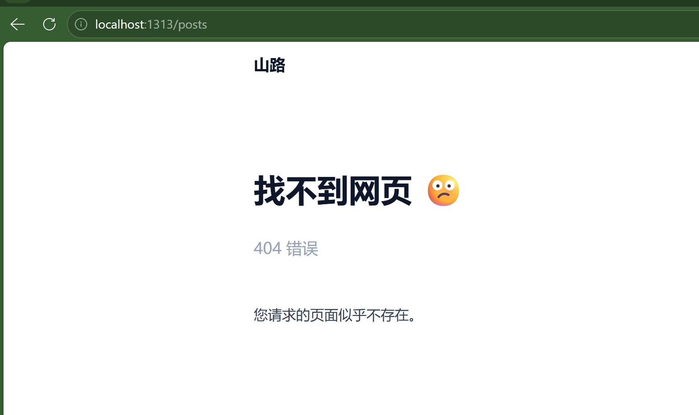

# Hugo 博客问题与解决方案

## 问题描述

1. **首页只显示 5 篇文章**
2. **点击"显示更多"报 404 错误**

## 问题原因

| 问题 | 原因 |
|------|------|
| 只显示 5 篇 | `params.toml` 中 `showRecentItems = 5` 控制首页显示数量 |
| 404 错误 | 文章存放在 `content/docs/` 目录，但"显示更多"链接指向 `/posts` 目录，该目录不存在 |




## 解决方案

### 1. 修改配置文件

**文件位置：** `config/_default/params.toml`

```toml
[homepage]
  showRecent = true
  showRecentItems = 5      # 可修改此数值调整首页显示数量
  showMoreLink = true
  showMoreLinkDest = "/docs"  # 改为 /docs，与文章存放目录一致
```

### 2. 创建列表页面

**文件位置：** `content/docs/_index.md`

```markdown
---
title: "文章"
description: "我的博客文章列表"
---
```

此文件用于生成 docs 目录的文章列表页面。

## 配置说明

| 参数 | 默认值 | 说明 |
|------|--------|------|
| `showRecent` | true | 是否在首页显示最新文章 |
| `showRecentItems` | 5 | 首页显示的文章数量 |
| `showMoreLink` | true | 是否显示"显示更多"链接 |
| `showMoreLinkDest` | /posts | "显示更多"跳转的目标路径 |

## 目录结构参考

```
content/
├── docs/           # 文章目录
│   ├── _index.md  # 列表页面（需创建）
│   ├── shell/
│   │   └── index.md
│   ├── blog/
│   │   └── index.md
│   └── xmindToMarkdown/
│       └── index.md
└── posts/         # 可选：另一个文章目录
```

## 注意事项

- Hugo 以 `content/` 下的子目录作为"section"
- 每个 section 需要 `_index.md` 才能生成列表页面
- "显示更多"的目标路径必须与实际存在的 section 对应
